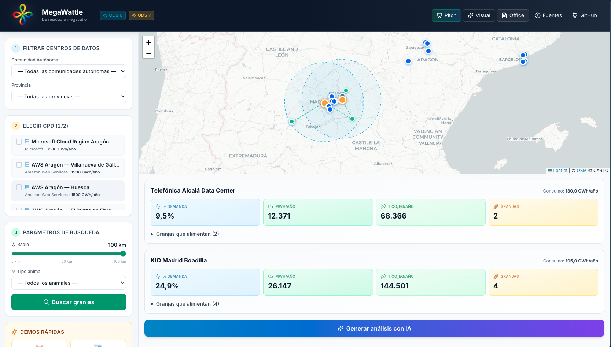

# MegaWattle

> **From waste to megawatt** — turning the environmental problem of Spanish macro-farms into the energy solution for data centers.

Project for the **Hackathon League for Social Good 2026** (Milan–Madrid). Challenge: SDG 6 (clean water) + SDG 7 (affordable and clean energy).



## The idea

Spain has macro-farms saturating aquifers with slurry (open EU procedure for non-compliance with the Nitrates Directive) and new hyperscale data centers stressing the electric grid (Microsoft Aragón alone projects 10,500 GWh/year — more than the entire region's consumption). MegaWattle geographically pairs both problems: **manure is digested into biogas → cogeneration produces electricity → the nearby data center consumes it**. Double SDG 6 + 7 impact, plus a critical bonus: avoided methane has a GWP of 28 — 28× more potent than CO₂.

## Stack

- **Backend**: Python 3.11 + Flask
- **Frontend**: React 18 + TypeScript + Vite + Tailwind CSS + Leaflet (map) + Chart.js
- **AI**: Azure AI Foundry with prompt caching (model configurable via env)
- **Data**: static JSON loaded in memory (no database)

## Setup

> **Requirements**: Python 3.11+ and Node.js 18+ installed.

### Option A — macOS / Linux with Make (recommended)

```bash
make dev          # starts Flask (5050) + Vite (5173) in parallel
```

Open **<http://localhost:5173>** (frontend with hot-reload).

Other targets:
- `make build` — bundles the frontend into `static/dist/`
- `make serve` — Flask only, serving the compiled bundle (single port on 5050)
- `make smoke` — quick calculation test
- `make stop` — frees ports 5050 and 5173
- `make clean` — removes venv and node_modules

### Option B — manual commands (Windows / macOS / Linux)

#### 1. Backend (Python + Flask)

**Windows (PowerShell or CMD)**:
```powershell
python -m venv .venv
.venv\Scripts\pip install -r requirements.txt
copy .env.example .env
:: edit .env and fill in ANTHROPIC_API_KEY
set PORT=5050
.venv\Scripts\python app.py
```

**macOS / Linux (bash/zsh)**:
```bash
python3 -m venv .venv
.venv/bin/pip install -r requirements.txt
cp .env.example .env
# edit .env and fill in ANTHROPIC_API_KEY
PORT=5050 .venv/bin/python app.py
```

#### 2. Frontend (React + Vite) — in a separate terminal

**Windows / macOS / Linux** (same):
```bash
cd frontend
npm install
npm run dev
```

Open **<http://localhost:5173>** — Vite proxies `/api`, `/fuentes` and `/healthz` to the backend on 5050 automatically.

#### 3. Backend only (no frontend dev server)

If you build the frontend for production first, Flask serves it on its own:

**Windows**:
```powershell
cd frontend
npm install
npm run build
cd ..
.venv\Scripts\python app.py
```

**macOS / Linux**:
```bash
cd frontend && npm install && npm run build && cd ..
.venv/bin/python app.py
```

Open **<http://localhost:5050>**.

### Environment variables

`.env` (copy from `.env.example`):
```
COPILOT_API=your-key
COPILOT_MODEL=model 
FLASK_ENV=development
PORT=5050
```

> Without an API key, the AI runs in *fallback* mode with a pre-computed analysis.

### System notes

- **macOS**: port 5000 is taken by AirPlay Receiver — that's why we use 5050.
- **Windows**: if `python` doesn't work, try `py -3` instead of `python`.
- **Linux**: you may need `python3` instead of `python`.

## Data

- **30 real data centers** with public information: Microsoft Aragón, AWS Aragón (3 campuses), Meta Talavera, Equinix MD2/MD3/MD4, Telefónica Alcalá, NTT, Interxion, Digital Realty, Merlin Edged Getafe, QTS Calatorao, Equinix BR2, Iron Mountain, Colt, KIO, Cologix, Stack Infrastructure, Data4, EdgeConneX, Adamo, Cellnex, Euskaltel, Iberdrola, Telefónica Sevilla, Ahead Málaga, R Telecomunicaciones.
- **52 livestock nodes aggregated by municipality** (MAPA 2024 Census + REGA + PRTR + DATADISTA): pig farming in Aragón / Cataluña / Murcia / Andalucía / Extremadura / Navarra; cattle in Castilla y León / Galicia / Asturias / Cantabria / País Vasco; poultry in Castilla-La Mancha / Comunidad Valenciana.

> The "farms" are **public municipal aggregates**, not individual operations. Coordinates = municipal centroids.

## Usage flow

1. **Filter data centers** by autonomous community → province.
2. **Select 1 or 2 data centers** (checkbox or click on the map).
3. **Define a search radius** (5–100 km) and optionally an animal type.
4. **See which farms can feed it** and what % of its demand they cover.
5. **Generate AI analysis**: the Azure-hosted model produces a structured report with narrative and comparative charts.

## Project structure

```
app.py                     # Flask entrypoint
config.py                  # loads env vars + data into memory
data/
  cpds.json                # 30 real data centers
  granjas.json             # 52 aggregated livestock nodes
  factores_biogas.json     # citable coefficients (IDAE, IPCC, IEA)
  cache_ai/                # pre-generated AI responses (presets)
services/
  geo.py                   # haversine
  calculos.py              # biogas → MWh → CO2eq → payback formulas
  matching.py              # radius-based matching
  ai_client.py             # AI client (Azure AI Foundry) + prompt caching + fallback
routes/
  views.py                 # GET / + GET /fuentes + static asset routes
  api.py                   # /api/cpds, /api/granjas, /api/match, /api/ai/analizar
frontend/                  # React + TypeScript + Vite SPA
  src/
    components/            # Header, Map, Filters, Results, AI panel
    pitch/                 # 3 pitch presentation modes (modern, visual, office)
    lib/                   # api client + zustand store
docs/
  fuentes.md               # full bibliography
  pitch.md                 # extended pitch script
  pitch-2min.md            # 2-min pitch + Q&A + glossary
  pitch-2min.pdf           # printable PDF version
  MegaWattle - Pitch.pptx  # PowerPoint export (modern style)
  MegaWattle - Pitch Office.pptx  # PowerPoint export (Microsoft style)
  demo.mov                 # platform demo video
```

## Technical documentation

- Citable formulas and factors: [docs/fuentes.md](docs/fuentes.md)
- Pitch script + expected Q&A: [docs/pitch.md](docs/pitch.md)
- 2-minute pitch + glossary: [docs/pitch-2min.pdf](docs/pitch-2min.pdf)

## Verification

```bash
# Smoke tests
curl http://localhost:5050/healthz
curl http://localhost:5050/api/cpds | python3 -m json.tool | head
curl -X POST http://localhost:5050/api/match \
  -H "Content-Type: application/json" \
  -d '{"cpd_ids":["microsoft-aragon"],"radio_km":50,"tipo_animal":"porcino"}'
```

Reference unit case: 5,000 fattening pigs → ~8,213 t/year of manure → ~502 MWh/year → ~2,775 t CO₂eq avoided → payback ~5.2 years.

## SDGs and legal framework

- SDG 6 — Clean water and sanitation
- SDG 7 — Affordable and clean energy
- Directive 91/676/EEC (Nitrates Directive)
- CJEU procedure C-575/22 against Spain

## Credits

Hackathon League for Social Good 2026 · Milan–Madrid · SDG 6 + SDG 7.

**Team Outliers** — Roberto Molero · Jonathan Brasales · Iris Amorim · Naizabeth Bermudez · Raúl Machaca.
